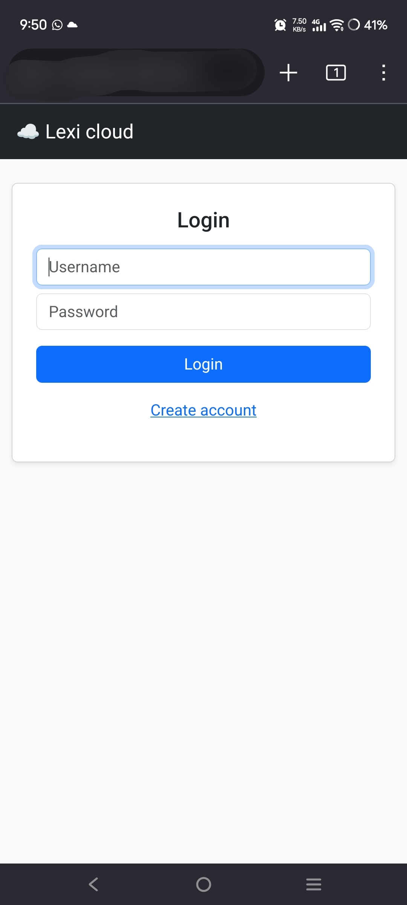
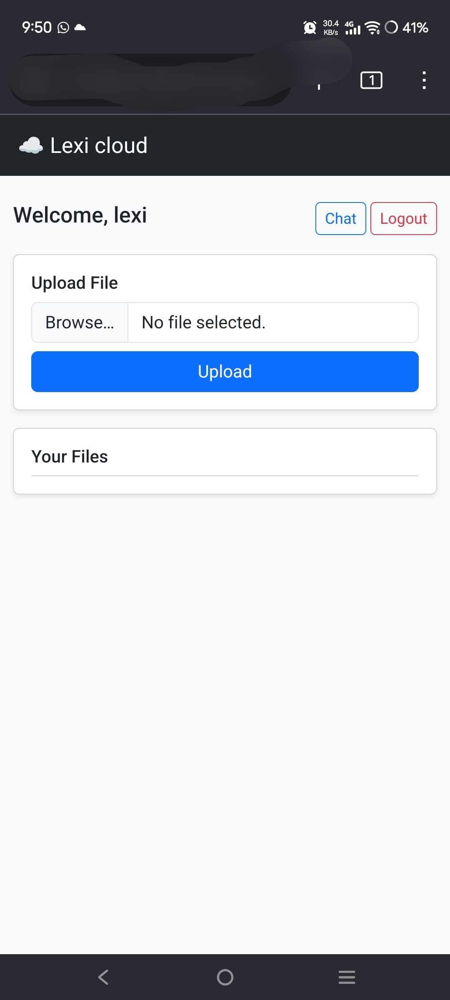
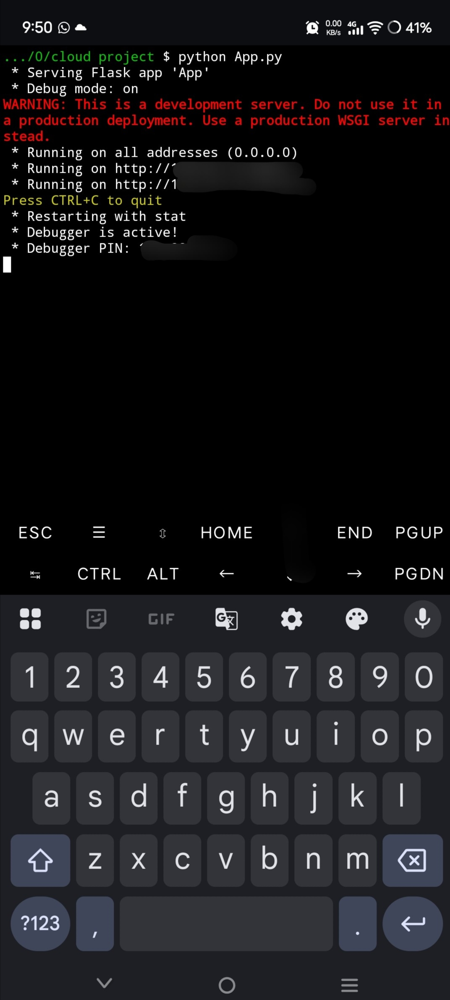

lexi cloud☁️

A personal cloud server built using Flask, designed to run on low-end devices like old phones.

## Why this project?
To build a simple, private cloud system that runs on low-end devices like old smartphones, without relying on external services.

## Features
- User login & registration
- File upload system
- Personal file storage
- Simple web interface

## Tech Stack
- Python (Flask)
- HTML/CSS

## How to Run
pip install -r requirements.txt
python app.py

## Screenshots

### Login

### Dashboard

### server

## Author
lexdos1147-max
